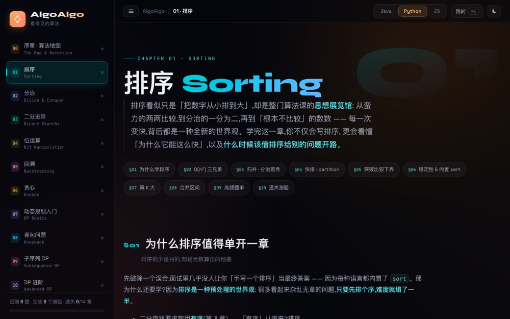

# AlgoAlgo — See Inside Algorithms

**▶ [Open the course](https://algo-algo.vercel.app)** — runs in your browser, nothing to install.

An interactive algorithms course for people starting from zero. Decision trees, DP tables
and shrinking intervals are replayed frame by frame, so you watch the state change instead
of trying to hold it in your head.

Sister site: [DataData](https://data-data.vercel.app) (data structures). The split is
deliberate — techniques that hang off a specific structure (two pointers, sliding window,
BFS/DFS, monotonic stacks) live there; the general problem-solving strategies live here.


*The course home — 13 chapters from sorting to string matching*



*Sorting, replayed frame by frame*

## The 13 chapters

| # | Chapter | What it covers |
|---|---|---|
| 00 | Prologue | Correct first, then fast · recursion as the foundation · complexity tiers |
| 01 | Sorting | The three simple sorts, merge, quicksort, the comparison lower bound, what your language actually uses |
| 02 | Divide and conquer | The master theorem, LC 50 / 23 / 53 |
| 03 | Binary search | Interval conventions, boundary templates, searching the answer space |
| 04 | Bit manipulation | Masks, subsets, XOR tricks, cross-language pitfalls |
| 05 | Backtracking | One decision tree behind subsets, combinations and permutations; pruning and dedup |
| 06 | Greedy | When greed is provable — the exchange argument, and when it fails |
| 07 | Dynamic programming | State, transition, initialization, order — the four questions |
| 08 | Knapsack | 0/1, unbounded, bounded; the rolling array and why the direction matters |
| 09 | Sequence DP | LCS, edit distance, LIS with binary search |
| 10 | Advanced DP | State machines, interval DP, bitmask DP |
| 11 | Math | Modular arithmetic, GCD, sieves, fast power, game theory |
| 12 | Strings | KMP, the next array, Rabin-Karp, Manacher |
| ✦ | Atlas | A decision map across both sites: signal → technique |

Each chapter follows the same rhythm: an intuition first, then a frame-by-frame
visualization, then real code in Java / Python / JavaScript, then the interview follow-ups,
then a quiz. Progress is stored locally in the browser.

## Running locally

Requires Node 22 (an `.nvmrc` is included):

```bash
nvm use
npm install
npm run dev      # http://localhost:3000
```

Build with type checking: `npm run build`.

## Structure

Next.js 15 (App Router) + TypeScript + React 19, plain CSS, no Tailwind. No API routes, so everything prerenders to static pages.

Each chapter is one folder under `app/` holding its page, its visualizations (`viz.tsx`) and
its own stylesheet, paired with a data file under `lib/` for the problem sets. Frames are
precomputed at module load — `buildXxx(): Frame[]` — and the component only renders frame *i*.

Shared pieces: the stepper in `lib/stepper.tsx`, the graph renderer, the quiz component,
progress tracking in `lib/progress.tsx`, and the chapter registry in `lib/curriculum.ts`
(the sidebar, command palette, prev/next links and progress all derive from it).

---

© 2026 Weiren Feng. All rights reserved. Published for reading and portfolio purposes; not
licensed for reuse, modification, or redistribution.
